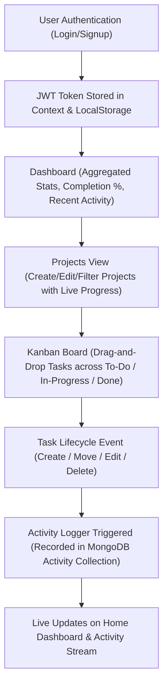

# 🚀 ToggleNest — Interview Master Guide

---

## 1. Project Overview

> **Elevator Pitch (How to say it in 30 seconds):**  
> *"ToggleNest is a full-stack MERN task and project management application designed to help teams and individuals plan, organize, and monitor workflows. It features interactive Kanban boards with drag-and-drop task progression, dynamic project metrics, automated audit activity logging, and role-based personal workspaces, all secured with JWT authentication."*

### Problem It Solves
* **Workflow Fragmentation**: Teams struggle with complex, bloated enterprise tools (like Jira) or overly simple to-do lists that lack project grouping and progress visibility.
* **Lack of Real-Time Progress Visibility**: ToggleNest automatically computes task completion rates and productivity metrics across projects without manual calculation.
* **Accountability & Audit Trails**: Every task creation, status transition, priority change, and assignee update is automatically recorded into an activity timeline.

---

## 2. Technology Stack & Architecture

| Layer | Technologies / Libraries | Purpose in ToggleNest |
| :--- | :--- | :--- |
| **Frontend Framework** | React.js (Vite) | Single Page Application (SPA) with fast component rendering and modular architecture. |
| **Routing & Auth Guards** | React Router DOM v6 | Client-side routing, nested settings routes, and `ProtectedRoute` guard wrapper. |
| **Drag & Drop** | `@hello-pangea/dnd` | Accessible, smooth HTML5 Kanban drag-and-drop between status columns (`todo`, `in-progress`, `done`). |
| **State Management** | React Context API (`AuthContext`) | Global user session persistence, token synchronization, and login/logout state across the app. |
| **Styling & Theming** | Vanilla CSS + CSS Variables | Glassmorphic cards, custom dark/light theme switching, responsive layouts, and interactive micro-animations. |
| **HTTP Client** | Axios + Interceptors | Centralized API communication with auto-attached JWT `Bearer` headers. |
| **Backend Runtime** | Node.js & Express.js (ES Modules) | RESTful API server with modular routers and centralized error handling. |
| **Database & ODM** | MongoDB Atlas & Mongoose | Document database with relational references (`ObjectId` refs) and MongoDB Aggregation Pipelines. |
| **Security & Auth** | JSON Web Tokens (JWT) & `bcryptjs` | Stateless token authorization, token expiration, and salted password hashing (10 salt rounds). |
| **Deployment** | Vercel (Frontend) & Render (Backend) | Cloud hosting with automated deployment pipelines. |

---

## 3. Target Audience

1. **Agile Software Development Teams**: Requiring lightweight sprint/task boards with priority and deadline tracking.
2. **Freelancers & Project Managers**: Managing multiple distinct client projects with individual task statistics and completion percentages.
3. **Student Groups & Startups**: Needing an intuitive, zero-learning-curve collaboration workspace with an audit activity history.

---

## 4. Key Features & End-to-End Workflow

### End-to-End System Workflow



### Core Features

1. **Interactive Kanban Board with Optimistic UI**:
   * Columns for `To Do`, `In Progress`, and `Done`.
   * Drag-and-drop with optimistic client-side updates (reverts automatically if the network request fails).
   * Card click-to-edit modal for updating title, description, priority (`urgent`, `high`, `medium`, `low`), assignee, and due dates.
   * Real-time search query filter and priority dropdown filter on the board.
2. **Dynamic Project Analytics & Progress Tracking**:
   * MongoDB `$lookup` aggregation calculates completed tasks, total tasks, and progress percentage on the fly.
   * Customizable project theme colors and descriptions.
3. **Interactive Login Animation**:
   * Custom mathematical eye-tracking animation on the login illustration that follows cursor movements via `Math.atan2(dy, dx)` and reacts to input field focus.
4. **Automated Activity Logging**:
   * Automatically captures user actions (task created, priority changed, task moved to "In Progress", task completed) and surfaces them in a chronological feed.
5. **Dark / Light Theme Switcher**:
   * Persistent theme toggle with root class modification (`document.documentElement.classList.toggle('dark')`) stored in `localStorage`.
6. **User Profile & Security Management**:
   * Editable user profiles (job title, department, organization, location) and secure password changes requiring old password verification and bcrypt hashing.

---

## 5. What Makes It Different from Existing Tools

| Feature | Standard To-Do Apps | Heavyweight Tools (Jira/Asana) | **ToggleNest** |
| :--- | :--- | :--- | :--- |
| **Setup Complexity** | Very basic, no projects | Complex onboarding, excessive configuration | **Zero-friction onboarding with immediate project & board creation** |
| **Performance & UI** | Plain text lists | Cluttered and slow | **Fast SPA, smooth drag-and-drop, and playful interactive animations** |
| **Progress Visibility** | Manual checkboxes | Requires manual report generation | **Automated MongoDB aggregation progress bars and live team productivity metrics** |
| **Audit Log** | None | Buried in submenus | **Dedicated chronological activity feed on both dashboard and activity tab** |

---

## 6. Your Contribution & Implementation Highlights

1. **Full-Stack RESTful API Architecture**: Built modular Express routes and Mongoose schemas with relational references between `User`, `Project`, `Task`, and `Activity`.
2. **Optimized Aggregation Pipeline**: Implemented a MongoDB `$aggregate` pipeline in `projectRoutes.js` to compute real-time project statistics (`totalTasks`, `completedTasks`) in a single database roundtrip rather than multiple N+1 queries.
3. **State Management & Route Protection**: Implemented React Context (`AuthContext`) and an Axios interceptor to securely store and attach JWT tokens, coupled with a `ProtectedRoute` wrapper component in React Router.
4. **Interactive UI & Optimistic Kanban Updates**: Built the drag-and-drop board using `@hello-pangea/dnd`, incorporating optimistic UI state updates for latency-free dragging with rollback on network errors.
5. **Security Hardening**: Implemented salted password hashing with `bcryptjs`, JWT verification middleware, input validation, and user-scoped query filtering to prevent cross-account data leaks.

---

# 7. Likely Interview Follow-Up Questions & Answers

---

### Category A: Architecture & Design

#### Q1: "Can you explain the high-level architecture of ToggleNest?"
> **Answer:**  
> *"ToggleNest is designed as a client-server Single Page Application (SPA).  
> On the frontend, we use React with Vite and React Router for fast, declarative client-side rendering. Communication with the backend happens asynchronously over HTTP/REST using an Axios instance configured with request interceptors.  
> On the backend, we run an Express.js server in Node.js organized into a layered architecture: middleware for JWT authentication, modular route handlers for each business domain (`auth`, `users`, `projects`, `tasks`, `activities`), and Mongoose models for schema definition and data validation.  
> The data tier is hosted on MongoDB Atlas, using document embedding for lightweight metadata and document references (`ObjectId`) for relational integrity between users, projects, and tasks."*

---

#### Q2: "Why did you choose MongoDB over a relational database like PostgreSQL for this project?"
> **Answer:**  
> *"MongoDB fits this project well due to its flexible document schema and native JSON compatibility with Node.js and React. In task and activity management, attributes can evolve (such as adding checklists, color tags, or custom metadata). MongoDB allows us to update schema fields without executing heavy table migrations.  
> For relational queries like computing completed vs total tasks per project, we leveraged MongoDB's aggregation pipeline (`$lookup`, `$match`, and `$addFields`), giving us the join capabilities we needed while retaining the flexibility of a document store."*

---

### Category B: Database & MongoDB Aggregations

#### Q3: "How do you calculate the project completion percentage efficiently without overwhelming the database?"
> **Answer:**  
> *"Instead of querying all tasks on the client and calculating progress in Javascript, or executing multiple roundtrip queries per project (the N+1 query problem), we use a single MongoDB aggregation pipeline in `projectRoutes.js`:  
> 1. `$match`: Filters projects belonging strictly to `req.user.id`.  
> 2. `$lookup`: Joins the `tasks` collection where `tasks.project` matches the project `_id`.  
> 3. `$addFields`: Calculates `totalTasks` using `$size`, and `completedTasks` using `$filter` where `status === 'done'`.  
> 4. `$project`: Strips out the full task array before sending the response.  
> This performs all calculations directly inside the MongoDB database engine in a single database trip."*

---

### Category C: Authentication & Security

#### Q4: "How is authentication implemented and secured in ToggleNest?"
> **Answer:**  
> *"We use stateless JSON Web Token (JWT) authentication:  
> 1. When a user registers or logs in, their password is verified against the bcrypt-hashed password stored in MongoDB (hashed with 10 salt rounds).  
> 2. If valid, the backend signs a JWT containing the user's `id` with a private `JWT_SECRET` and a 7-day expiration time.  
> 3. The frontend stores this token in `localStorage` and loads it into `AuthContext`.  
> 4. An Axios request interceptor automatically extracts the token and attaches `Authorization: Bearer <token>` to every subsequent API call.  
> 5. An Express `authMiddleware` intercepts protected endpoints, verifies the token with `jwt.verify()`, and attaches `req.user = { id: decoded.id }` to the request object."*

---

#### Q5: "How do you prevent unauthorized users from viewing or modifying someone else's tasks or projects?"
> **Answer:**  
> *"Every protected database query is scoped to the authenticated user ID extracted directly from the verified JWT (`req.user.id`), never from client-supplied request body parameters.  
> For instance, when updating or deleting a task:  
> ```javascript
> Task.findOneAndUpdate({ _id: req.params.id, user: req.user.id }, { $set: req.body });
> ```  
> Even if a malicious user guesses another task's `_id`, the query returns `404 Not Found` because the `user` field does not match the token's identity."*

---

### Category D: Frontend State & Drag-and-Drop

#### Q6: "How did you implement the Kanban drag-and-drop, and how do you handle network latency or errors?"
> **Answer:**  
> *"We used `@hello-pangea/dnd` (the maintained successor to `react-beautiful-dnd`).  
> In `Board.jsx`, the board is wrapped in a `DragDropContext`, and each column is a `Droppable` with the status (`todo`, `in-progress`, `done`) as its ID.  
> When `onDragEnd` fires:  
> 1. We first preserve the existing state array in a snapshot variable (`previousTasks`).  
> 2. We perform an **optimistic UI update**, instantly updating the local React state so the card snaps into place with zero visual lag.  
> 3. We send a `PATCH /api/tasks/:id` request with `{ status: newStatus }` to the backend.  
> 4. If the request fails (e.g. network disconnect), the `catch` block rolls back the state to `previousTasks` and notifies the user."*

---

#### Q7: "How does the eye-tracking animation on the login screen work?"
> **Answer:**  
> *"The interactive cartoon illustration tracks the cursor across the viewport:  
> 1. A global `mousemove` event listener calculates the center coordinates `(cx, cy)` of each eye element using `getBoundingClientRect()`.  
> 2. It calculates the angle of the mouse relative to the eye center using `Math.atan2(dy, dx)`.  
> 3. It clamps the maximum translation distance so the pupils stay within the eye boundary.  
> 4. It sets CSS `transform: translate(x, y)` on the pupil elements.  
> 5. When focusing on the password field or toggling password visibility, it overrides tracking and triggers a locked glance animation."*

---

### Category E: Challenges Faced & Solutions

#### Q8: "What was the most challenging technical problem you solved on this project?"
> **Answer:**  
> *"One key challenge was maintaining data synchronization between the Kanban board, project progress bars, and the activity feed.  
> Initially, task status changes were decoupled from activity logging, which meant activities could fail to record if an update happened, or stale task counts appeared on the project cards.  
> I solved this by:  
> 1. Creating a unified event lifecycle in the backend: whenever a task status or priority changes in `taskRoutes.js`, it atomically creates a corresponding `Activity` document with descriptive messages (like 'moved task to In Progress' or 'completed task').  
> 2. Offloading project statistics calculation to a MongoDB aggregation pipeline on the backend, ensuring progress percentages are always mathematically accurate and computed directly from live database state."*

---

### Category F: Scalability, Limitations & Future Improvements

#### Q9: "What are the current limitations of ToggleNest, and how would you scale it for 100,000 active users?"
> **Answer:**  
> *"**Current Limitations:**  
> * Task synchronization currently uses REST polling/refetching on page loads rather than full two-way WebSockets.  
> * Tasks are owned by individual users rather than multi-member team workspaces with granular permissions (Admin/Editor/Viewer).  
> 
> **How I Would Scale It:**  
> 1. **Real-Time Collaboration**: Integrate **Socket.io** so that when one teammate moves a card, all other users viewing the board see the change in real-time without refreshing.  
> 2. **Database Indexing & Caching**: Add compound indexes on `{ user: 1, project: 1, status: 1 }` in MongoDB to keep queries sub-millisecond, and introduce **Redis** for caching frequently accessed dashboard stats.  
> 3. **Pagination**: Implement cursor-based pagination for activity logs and task lists so that large projects with thousands of tasks load smoothly.  
> 4. **File Attachments**: Integrate AWS S3 / Cloudinary for task attachments and media uploads."*

---

### 💡 Quick Tips for the Interview

1. **Be Conversational**: Use terms like *"optimistic updates"*, *"stateless JWT authorization"*, and *"MongoDB aggregation pipelines"* naturally.
2. **Quantify Results**: Mention how the aggregation pipeline reduced multi-query latency into a single roundtrip.
3. **Show Product Awareness**: Emphasize that you didn't just build UI; you thought through security, privacy scoping, edge-case rollbacks, and developer UX.
